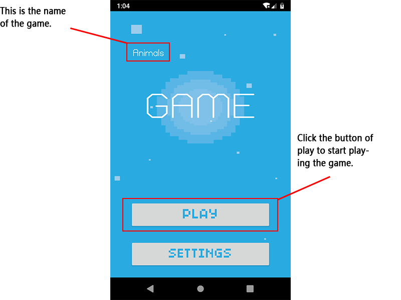

# animals-game
The game is very easy and interesting. You just need to find the right picture of the notice word.
该游戏非常简单，你仅仅需要根据文字提示点击正确的图片即可。

This is the display gif of my game running on the Genymotion virtual devices:

该游戏在虚拟机上的运行效果如下所示：

This is the main activity of the game and click the button of “Play” to start!

这是进入游戏的主界面，点击“play”即可开始游戏!

When the screen is rotated, the UI surface could also be fit for the screen:

当旋转手机为横屏时界面也随之旋转：

Next is the game activity. Enjoy it!

下面进入游戏界面，尽情享受它吧！

If you click the right picture accoding to the text, you will get another one score:

如果你能正确点击要求你点击的图片，将能得到一分：

If you click the wrong picture, you will lose the game and the game is over:

如果你选错了，游戏就会结束：

If you choose all the pictures right and you win!

如果你全选正确了，你就会进入胜利界面。

Then you can comment the game and don't forget to give thumb to it if you like it.

你可以对此游戏进行点评。如果你喜欢这款游戏的话别忘了给它点赞哦。

